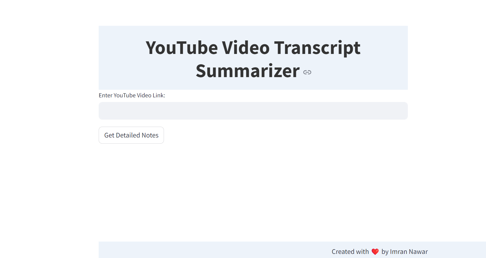
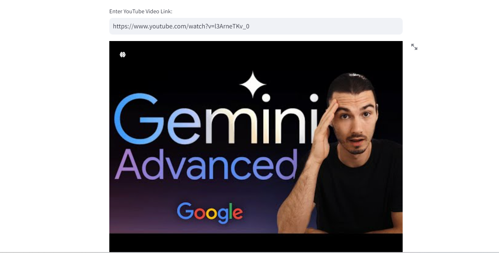
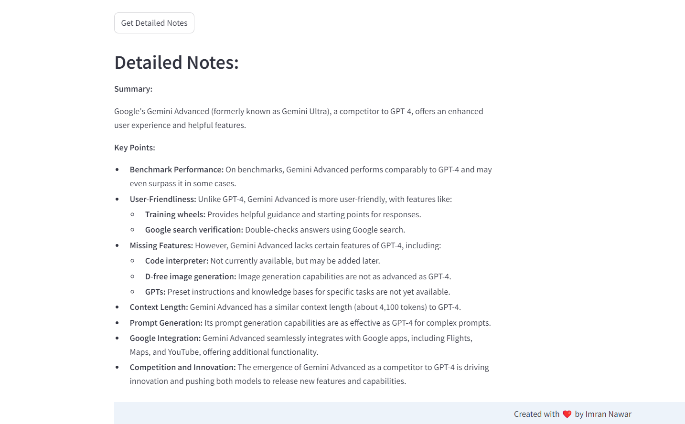

# YouTube Video Transcript Summarizer with Gemini API

This project provides a Streamlit web application that extracts transcripts from YouTube videos and generates detailed notes using Google's Gemini API. The application is designed to be user-friendly and efficient, offering a simple interface to summarize YouTube videos into concise and valuable notes.

## Features
- Extracts transcript details from YouTube videos.
- Utilizes Google's Gemini API for generating detailed content.
- User-friendly interface built with Streamlit.
- Displays video thumbnail for better visualization.
- Handles errors gracefully, such as when subtitles are disabled.

## Screenshots




## Installation
Follow these steps to set up the project:

1. **Create an environment:**
    ```sh
    python -m venv myEnv
    ```

2. **Activate the environment:**
    ```sh
    myEnv\Scripts\activate
    ```

3. **Install the necessary libraries:**
    ```sh
    pip install -r requirements.txt
    ```

4. **Generater you own Google's Gemini API key**
   ```sh
   # Replace GOOGLE_API_KEY with your own Gemini API key.
    genai.configure(api_key=os.getenv("GOOGLE_API_KEY"))
   ```
## Usage
To run the application, use the following command:
```sh
streamlit run app.py
```

## Contributing
Feel free to contribute to this project by submitting a pull request. For major changes, please open an issue first to discuss what you would like to change.

## License
This project is licensed under the MIT License.

---

`Created with ❤️ by [Imran Nawar]`